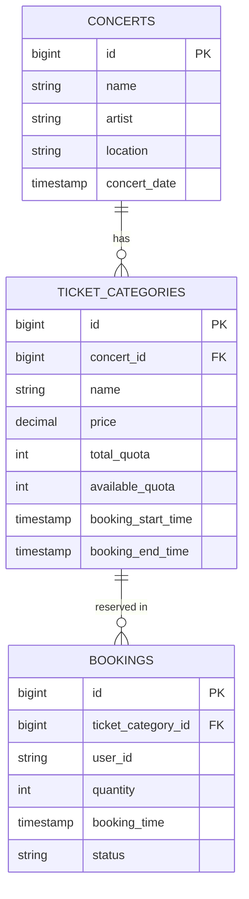

# EDTS Concert Ticketing System

High-concurrency RESTful API for concert ticket booking built with Spring Boot 3, Spring Data JPA, and H2 In-Memory Database. Designed to handle high-volume ticket sales without race conditions, quota overbooking, or unauthorized access outside specified booking time windows.

---

## Tech Stack

* Java: 17
* Framework: Spring Boot 3.x
* Database: H2 In-Memory Database (MySQL/PostgreSQL compliant schema via Hibernate Dialect)
* ORM: Spring Data JPA / Hibernate
* Documentation: OpenAPI 3.0 / Swagger UI
* Build Tool: Maven

---

## Key Features

* Concert Search API: Search available concerts by keyword (name or artist).
* Time-Restricted Booking API: Real-time ticket reservation restricted within a specific booking window (`booking_start_time` to `booking_end_time`).
* Concurrency Safety: Powered by Pessimistic Locking (`@Lock(LockModeType.PESSIMISTIC_WRITE)`) to guarantee zero overbooking under high-traffic user access (100+ requests/sec).
* Booking Retrieval API: Fetch completed booking transaction records.
* Interactive API Documentation: Swagger UI for FE/Mobile developers integration.

---

## Database Design & Structure

The database schema is normalized and designed with high-concurrency constraints in mind.

### Entity Relationship Diagram (ERD) Overview


### Database Structure Explanation

1. **`concerts`**: Stores master data for concert events (e.g., event name, artist, venue location, and event date).
2. **`ticket_categories`**: Holds ticket tier details (e.g., VIP, CAT 1) linked to a concert (`concert_id`). Includes `available_quota` managed via Pessimistic Locking to ensure concurrency safety, alongside `booking_start_time` and `booking_end_time` to enforce the booking time window constraint.
3. **`bookings`**: Stores completed reservation transactions linked to a ticket category (`ticket_category_id`), capturing `user_id`, quantity booked, execution timestamp, and transaction status.
---

## Getting Started

### Prerequisites
* Java 17 or higher

### Running the Application

1. Clone the repository:
   git clone <repository-url>
   cd edts-ticketing-system

2. Run the application:

    * Option A (via Terminal / CLI):
      ./mvnw spring-boot:run

    * Option B (via IDE):
      Open project in IntelliJ IDEA, locate `EdtsTicketingSystemApplication.java`, and click Run.

   (The application will automatically start on http://localhost:8080 and seed initial dummy data)

---

## API Documentation (For Front-End Integration)

Interactive Swagger UI is available at:
👉 http://localhost:8080/swagger-ui.html

### Endpoints Overview

1. Search Concerts
    - Endpoint: `GET /api/concerts?keyword={keyword}`
    - Description: Search concerts by title or artist name.

2. Book Ticket
    - Endpoint: `POST /api/bookings`
    - Payload:
      ```json
      {
        "ticketCategoryId": 3,
        "userId": "user-123",
        "quantity": 1
      }
      ```
    - Description: Purchase tickets. Enforces race-condition locking and booking time window checks.

3. Get All Bookings
    - Endpoint: `GET /api/bookings`
    - Description: Retrieve transaction history.

---

## Running Automated & Concurrency Tests

To execute the test suite (including the 100-concurrent-thread test for pessimistic locking):

* Option A (via Terminal / CLI):
  ./mvnw test

* Option B (via IDE):
  Open `BookingServiceConcurrencyTest.java` and click Run Test (Play icon).